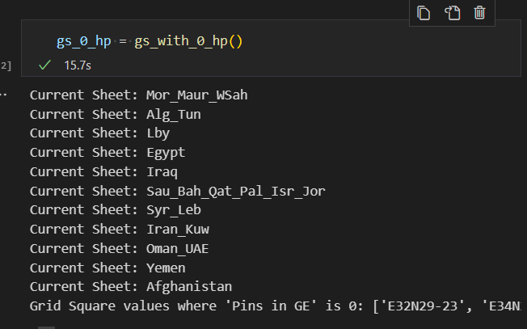

Here's a corrected version of the text:

# eamena-data

EAMENA reference data hosts curated datasets or curated dataset documentation that are regularly published or planned to be published in the ['eamena' community on Zenodo](https://zenodo.org/communities/eamena) or on other platforms.

## Reference Data

The [reference_data](https://github.com/eamena-project/eamena-data/tree/main/reference_data) folder contains data for [concepts/hp](https://github.com/eamena-project/eamena-data/tree/main/reference_data/concepts/hp) (lists, photographs, etc.), MENA country borders, layouts (color ramps, etc.), and more.

## Published Data

The [published_data](https://github.com/eamena-project/eamena-data/tree/main/published_data) folder contains a list of data published on Zenodo.

## Working Data

The [working_data](https://github.com/eamena-project/eamena-data/tree/main/working_data/hp_by_gs_nb) folder contains data used for monthly and yearly reports.

### Arcadia annual report

* calculate GS with 0 HP

